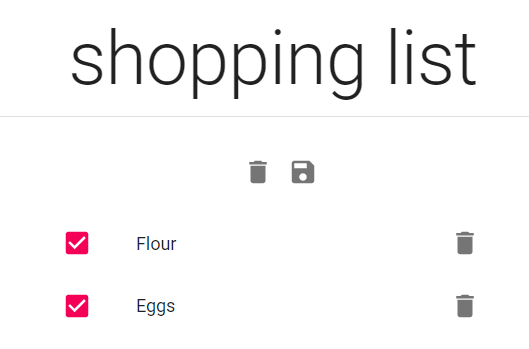

# CuttingBoard-frontend

Explore the [project page](https://github.com/nom-com/CuttingBoard-frontend)\
Working Project Link: http://cuttingboard.generictech.org/

## Table of Contents

- [About the Project](#about-the-project)
  - [Responsive ](#responsive-design)
  - [Frontend](#frontend)
  - [Backend](#backend)
  - [Features](#features)
  - [Screenshots](#screenshots)
- [Roadmap](#roadmap)
- [License](#license)
- [Contact](#contact)
- [Acknowledgements](#acknowledgements)

## About The Project

  Bored of eating the same old foods, night after night?
  New to cooking and eager to learn beginner-friendly recipes?
  Try discovering something new with Cutting Board

  Whether you're a Seasoned Chef, or just cutting your teeth in the world of cooking, 
  Cutting Board makes learning new recipes a piece of cake!
  
  Our large and easy to use library of recipes allows you to not only learn,
  but also create countless recipes of your own design!

<!--  -->

### Responsive Design

Using Material-UI to create seamless responsive design through the use of their design system, web accessibility tools, and component library!

<!--  -->

<!--  -->

### Frontend

- React.js
- Material-UI
- S3 Amazon Static Web Hosting

### Backend

- AWS EC2 Instance hosting
- RDS Amazon Web Services
- Jenkins CI/CD Pipelines
- Java Spring RESTful API

## Features

- Recommends our users' most popular Recipes to you, even if you haven't set up an account.
- Search Recipes by any field you type into our handy Search feature.
- Create a Shopping List of products to help you shop.
- Mobile-friendly.
- Allows you to set up an account to remember favorite recipes and shopping lists.

<!--  -->
## Screenshots
Landing:\

Recommended Recipes:\

Favorites Manager:\

View Recipe:\

Search Recipes:\

Shopping List:\

## Roadmap

Current known issues:

Track [open issues](https://github.com/nom-com/CuttingBoard-frontend/issues)

## License

MIT License

Copyright (c) 2020 nom-com

## Contact

<!-- Twitter - [@DanielMont_Eton](https://twitter.com/DanielMont_Eton)

LinkedIn - [LinkedIn](https://www.linkedin.com/in/daniel-mont-eton-43a81055/) -->

## CONTRIBUTIONS

[CuttingBoard-backend](https://github.com/nom-com/CuttingBoard-backend)
[jwdavis1989](https://github.com/jwdavis1989)
[jwilson717](https://github.com/jwilson717)
[Dreadcyc](https://github.com/Dreadcyc)
[dansirdan](https://github.com/dansirdan)
